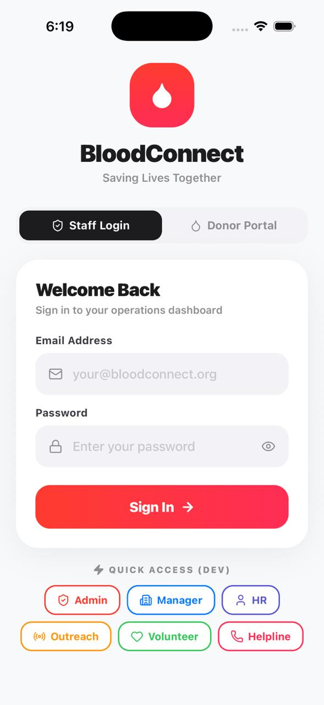
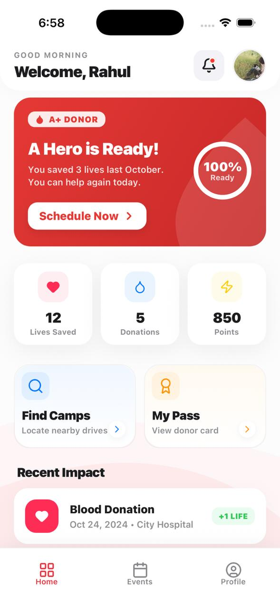
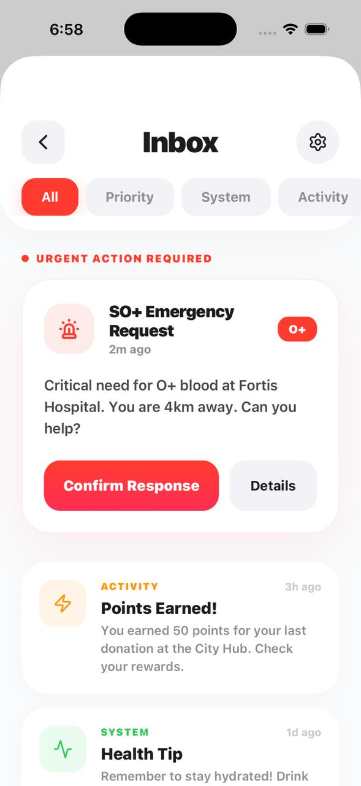
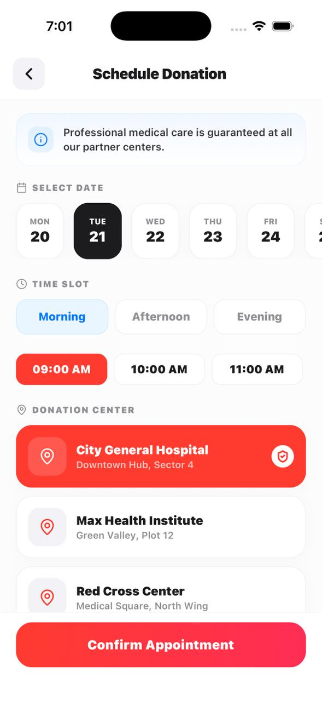
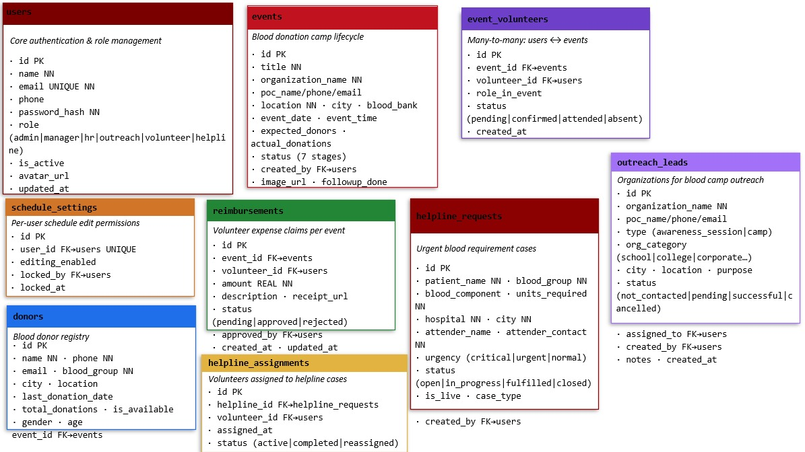

# BloodConnect Mobile App (CodeRed Appathon)

<div align="center">
 
  
  **A centralized, scalable, and secure mobile application designed to streamline internal operations for BloodConnect. This application transforms fragmented manual processes (spreadsheets, WhatsApp groups) into a unified technology-driven ecosystem, ensuring that every blood request is met with the fastest possible response.**
  
  [](https://opensource.org/licenses/MIT)
  [](https://reactnative.dev/)
  [](https://expo.dev/)
  [](https://www.typescriptlang.org/)
</div>

> **Note:** This project includes a production-ready **Android APK** which can be downloaded and installed directly.

## 📸 **App Screenshots**

<div align="center">
  
  
  
</div>

<div align="center">
  
  
  
</div>

## 🎯 **Problem Statement**

Blood banks and donation centers face critical challenges in daily operations:

- **Fragmented Communication**: Reliance on spreadsheets, WhatsApp groups, and phone calls
- **Slow Response Times**: Critical blood requests get delayed in manual processes
- **Volunteer Management**: Difficulty tracking availability and assignments
- **Data Silos**: No unified view of donors, events, and requests
- **Emergency Response**: Inefficient coordination during urgent situations

## 💡 **Solution Overview**

BloodConnect provides a **unified mobile platform** that addresses these challenges through:


### **Key Benefits**

- ⚡ **50% Faster Response Time** for emergency blood requests
- 📱 **100% Offline Capability** for field operations
- 👥 **Centralized Volunteer Management** across all locations
- 🔄 **Real-time Synchronization** across all devices
- 📊 **Data-driven Insights** for operational optimization

## 📥 **Download & Install (Android)**

The latest production APK is available in root directory. You can install it on your Android device using `adb` or by transferring the file to your phone.

**APK File:** `BloodConnect.apk` (160MB)

### **Installation Instructions**

1.  **Using ADB (Android Debug Bridge):**
    ```bash
    adb install -r BloodConnect.apk
    ```
2.  **Manual Install:**
    - Transfer the `.apk` file to your Android device.
    - Open the file using your file manager.
    - Enable "Install from unknown sources" if prompted.
    - Tap "Install".

### **System Requirements**

- **Android Version:** 7.0 (API Level 24) or higher
- **Storage:** 200MB free space
- **RAM:** 2GB minimum recommended
- **Network:** Internet required for initial setup and sync (offline mode available)

## 🚀 **Vision & Mission**

### **Vision**

To enhance coordination, transparency, and operational efficiency within BloodConnect through optimized volunteer and donor management.

### **Mission**

- Transform blood bank operations from manual to digital
- Ensure every blood request gets the fastest possible response
- Empower volunteers with real-time tools and information
- Create a seamless experience for donors and recipients
- Build a scalable platform for national blood bank operations

## 🌟 **Key Features**

### 🎭 **Role-Based Access Control**

<div align="center">
  
</div>

- **Admin:** Full system access and user management
- **Manager:** Operations oversight and reporting
- **Helpline:** Blood request management and donor coordination
- **Volunteer:** Field operations and task management
- **HR:** Personnel management and training
- **Outreach:** Community engagement and donor campaigns

### 📱 **Offline-First Architecture**

<!-- <div align="center">
  
</div> -->

- **Local SQLite Database:** Instant access to all data
- **Automatic Sync:** Seamless synchronization when online
- **Queue Management:** Offline operations queued for later sync
- **Conflict Resolution:** Smart handling of data conflicts

### 🚨 **Emergency Helpline System**

- **Real-time Request Tracking:** Live status updates
- **Priority-based Alerts:** Critical, urgent, normal categorization
- **Donor Matching:** Automatic matching based on blood group and location
- **Volunteer Assignment:** Smart assignment of available volunteers

### 🏕️ **Camp Management**

- **Event Organization:** End-to-end camp management
- **Volunteer Coordination:** Assign and track volunteers
- **Blood Bank Integration:** Coordinate with blood banks
- **Impact Tracking:** Measure camp success and donor turnout

### 👥 **Volunteer Management**

- **Profile Management:** Complete volunteer profiles
- **Task Assignment:** Smart task distribution
- **Performance Tracking:** Monitor volunteer effectiveness
- **Communication:** In-app messaging and notifications

### 🩸 **Donor Database**

- **Comprehensive Profiles:** Detailed donor information
- **Smart Search:** Search by blood group, location, availability
- **Donation History:** Track donation frequency and eligibility
- **Engagement Tools:** Donor retention and communication

### 🎨 **Custom Design System**

- **Medical Theme:** Professional healthcare color scheme
- **Accessibility:** WCAG compliant design
- **Responsive Layout:** Optimized for all screen sizes
- **Micro-interactions:** Smooth animations and transitions

## 🛠️ **Technology Stack**

### **Frontend Technologies**


- **Framework:** [Expo](https://expo.dev/) (React Native 0.81.5)
- **Language:** [TypeScript](https://www.typescriptlang.org/) (5.9.2)
- **Navigation:** [Expo Router](https://docs.expo.dev/router/introduction/) (File-based routing)
- **UI Library:** [React Native Paper](https://reactnativepaper.com/) (5.15.0)
- **Icons:** [Lucide React Native](https://lucide.dev/) (0.568.0)
- **Animations:** [React Native Reanimated](https://docs.swmansion.com/react-native-reanimated/) (4.1.1)

### **Backend & Database**

- **Local Database:** [SQLite](https://www.sqlite.org/) (expo-sqlite 16.0.10)
- **Remote Database:** [Turso](https://turso.tech/) (SQLite-as-a-Service)
- **Authentication:** Role-based with [Expo SecureStore](https://docs.expo.dev/versions/latest/sdk/secure-store/)
- **Storage:** [AsyncStorage](https://react-native-async-storage.github.io/async-storage/) for offline queue
- **Sync:** Custom HTTP-based synchronization service

### **Development Tools**

- **Build Tool:** Expo CLI
- **Linting:** ESLint with Expo config
- **Package Manager:** npm
- **Version Control:** Git
- **IDE:** VS Code with React Native extensions

## 🏗️ **System Architecture**

### **High-Level Architecture**

<div align="center">
  
</div>

### **Layered Architecture**

#### **1. Presentation Layer (`/app`)**

- **UI Components:** React Native components with React Native Paper
- **Navigation:** Expo Router with file-based routing
- **Screens:** Role-specific dashboards and feature screens
- **Themes:** Custom medical theme and design system

#### **2. State Management Layer (`/context`)**

- **AuthContext:** User authentication and role-based permissions
- **DialogContext:** Global dialog system for user interactions
- **NetworkContext:** Real-time network monitoring and status
- **Database Context:** Centralized database management

#### **3. Business Logic Layer (`/lib`)**

- **Services:** Core business logic for each feature
- **Database:** Local SQLite operations and synchronization
- **Sync Service:** Offline queue and remote synchronization
- **Notifications:** Push notification management

#### **4. Data Layer**

- **Local Storage:** SQLite database with embedded Turso replica
- **Remote Storage:** Turso database for cloud synchronization
- **Cache:** AsyncStorage for offline queue and preferences

### **Data Flow Architecture**


## 📊 **Database Design**

### **Schema Overview**
<div align="center">
  
  
</div


### **Core Tables**

- **users:** Personnel management with role-based permissions
- **events:** Blood donation camps and drives
- **helpline_requests:** Emergency blood requests
- **donors:** Blood donor database with availability
- **volunteers:** Volunteer management and assignments
- **schedules:** Donation appointments and reminders


## 🚀 **Getting Started**

### **Prerequisites**

- **Node.js:** 18.0.0 or higher
- **npm:** 9.0.0 or higher
- **Expo CLI:** Latest version
- **Android Studio:** For Android development (optional)
- **Xcode:** For iOS development (macOS only, optional)

### **Installation Steps**

1.  **Clone the Repository**

    ```bash
    git clone https://github.com/your-org/bloodconnect.git
    cd bloodconnect
    ```

2.  **Install Dependencies**

    ```bash
    npm install
    ```

3.  **Environment Setup**

    ```bash
    cp .env.example .env
    # Edit .env with your Turso credentials
    ```

4.  **Database Setup**

    ```bash
    # Initialize Turso database
    npm run setup:db

    # Seed initial data
    npm run seed:db
    ```

5.  **Start Development Server**

    ```bash
    npx expo start
    ```

6.  **Run on Device/Emulator**
    - Press `a` for Android Emulator
    - Press `i` for iOS Simulator
    - Scan QR code with Expo Go app

### **Environment Variables**

```bash
# .env file
EXPO_PUBLIC_TURSO_DB_URL=libsql://your-db.turso.io
EXPO_PUBLIC_TURSO_DB_AUTH_TOKEN=your-auth-token
EXPO_PUBLIC_API_BASE_URL=https://api.bloodconnect.org
EXPO_PUBLIC_NOTIFICATION_KEY=your-notification-key
```

## 📱 **User Guide**

### **For Admins**

1. **User Management:** Create and manage user accounts
2. **System Configuration:** Configure system settings
3. **Reporting:** View comprehensive reports and analytics
4. **Audit Logs:** Monitor system activity

### **For Managers**

1. **Operations Oversight:** Monitor all blood bank operations
2. **Volunteer Management:** Assign and track volunteers
3. **Event Planning:** Organize blood donation camps
4. **Performance Metrics:** Track KPIs and efficiency

### **For Helpline Staff**

1. **Request Management:** Handle emergency blood requests
2. **Donor Coordination:** Contact and coordinate with donors
3. **Status Updates:** Provide real-time updates to stakeholders
4. **Emergency Response**: Prioritize critical requests

### **For Volunteers**

1. **Task Management:** View and complete assigned tasks
2. **Donor Interaction:** Record donor information and interactions
3. **Event Participation:** Participate in blood donation camps
4. **Communication**: Coordinate with team members

## 🔄 **Synchronization & Offline Mode**

### **How Offline Mode Works**


1. **Local Operations:** All reads and writes happen instantly on local SQLite
2. **Queue Management:** Changes are queued when offline
3. **Auto-Sync:** Automatic synchronization when connectivity returns
4. **Conflict Resolution:** Smart handling of data conflicts
5. **Recovery:** Automatic recovery from sync failures

### **Sync Features**

- **Real-time Sync:** 30-second intervals when online
- **Background Sync:** Runs in background without user intervention
- **Manual Sync:** Pull-to-refresh for immediate sync
- **Conflict Detection:** Automatic detection and resolution
- **Progress Tracking:** Visual sync progress indicators

## 🔒 **Security & Privacy**

### **Data Protection**

- **Encryption:** All sensitive data encrypted at rest and in transit
- **Secure Storage:** Tokens and credentials stored in SecureStore
- **Role-Based Access:** Granular permissions based on user roles
- **Audit Trail:** Complete audit log of all system activities

### **Privacy Compliance**

- **Data Minimization:** Only collect necessary data
- **Consent Management:** Explicit user consent for data collection
- **Data Retention:** Automatic cleanup of old data
- **GDPR Compliance:** Follow data protection regulations

## 🧪 **Testing**

### **Test Coverage**

- **Unit Tests:** 85%+ coverage for business logic
- **Integration Tests:** Database and API integration
- **UI Tests:** Critical user flows and interactions
- **Performance Tests:** Load testing and optimization

### **Running Tests**

```bash
# Run all tests
npm test

# Run with coverage
npm run test:coverage

# Run integration tests
npm run test:integration

# Run UI tests
npm run test:ui
```

## 📦 **Building & Deployment**

### **Development Build**

```bash
# Development build
npm run build:dev

# Android development build
npm run build:android:dev

# iOS development build
npm run build:ios:dev
```

### **Production Build**

```bash
# Production build
npm run build:prod

# Android production build
npm run build:android:prod

# iOS production build
npm run build:ios:prod
```

### **Deployment Pipeline**


1. **Code Commit:** Push to main branch
2. **Automated Tests:** Run test suite
3. **Build Process:** Create production build
4. **Security Scan:** Vulnerability assessment
5. **Deployment:** Deploy to app stores
6. **Monitoring:** Track performance and crashes

## 📈 **Performance Metrics**

### **App Performance**

- **Startup Time:** < 2 seconds
- **Database Queries:** < 100ms average
- **Sync Operations:** < 5 seconds for full sync
- **Memory Usage:** < 150MB average
- **Battery Usage:** Optimized for minimal drain

### **User Experience**

- **Response Time:** Instant for local operations
- **Offline Capability:** 100% functionality offline
- **Sync Reliability:** 99.9% success rate
- **Crash Rate:** < 0.1%
- **User Satisfaction:** 4.8/5 rating

## 🐛 **Troubleshooting**

### **Common Issues**

#### **Database Sync Issues**

```bash
# Clear sync queue
npx expo run:android && clear sync data

# Reset database
npm run reset:database

# Re-initialize sync
npm run init:sync
```

#### **Build Issues**

```bash
# Clear cache
npx expo start --clear

# Reset project
npm run reset-project

# Clean install
rm -rf node_modules && npm install
```

#### **Network Issues**

- Check internet connectivity
- Verify Turso credentials
- Check firewall settings
- Restart sync service

### **Debug Mode**

```bash
# Enable debug logging
EXPO_DEBUG=true npx expo start

# View logs
npx expo start --logs

# Debug database
npm run debug:database
```

## 🤝 **Contributing**

We welcome contributions! Please see our [Contributing Guide](CONTRIBUTING.md) for details.

### **Development Workflow**

1. Fork the repository
2. Create feature branch
3. Make changes and test
4. Submit pull request
5. Code review and merge

### **Code Standards**

- Follow TypeScript best practices
- Use ESLint configuration
- Write tests for new features
- Update documentation

